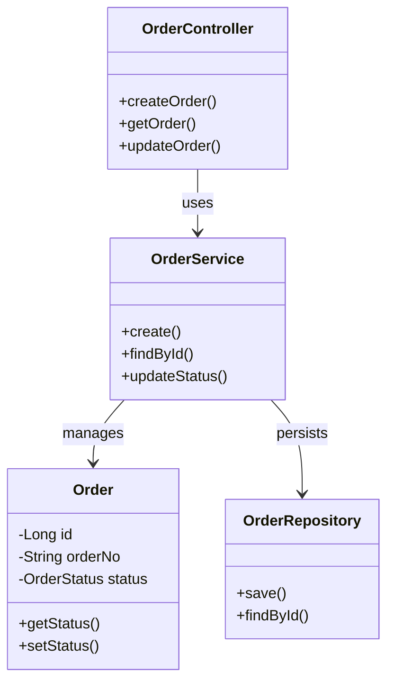
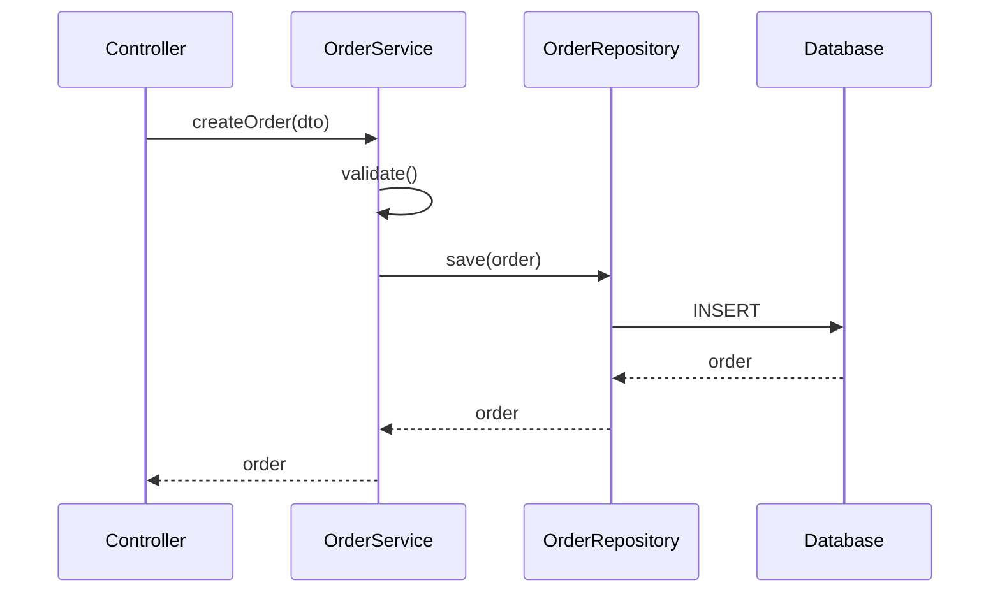
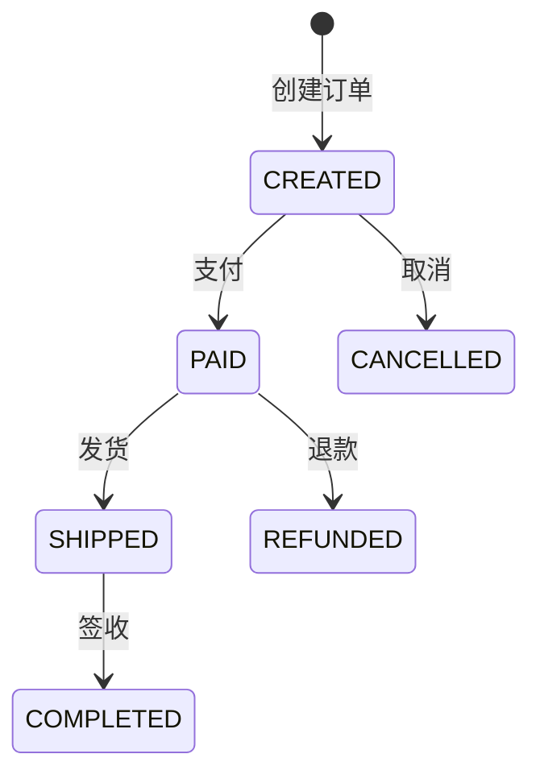
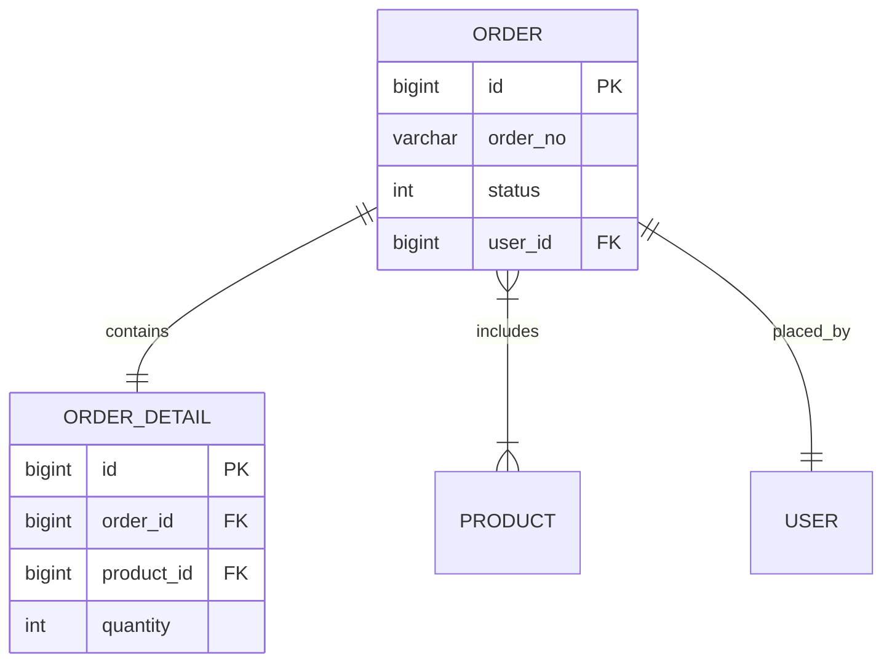
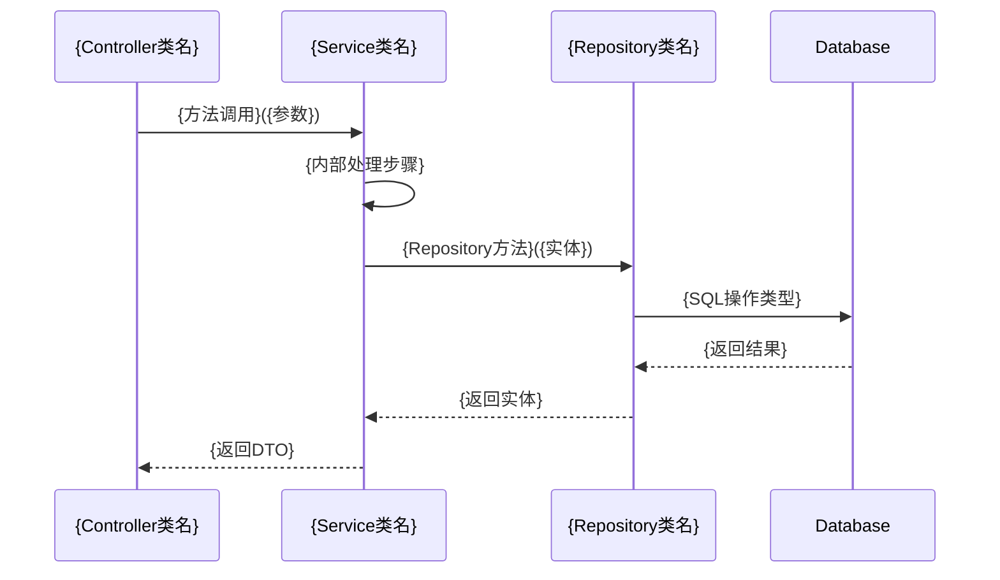

# biz-analysis-4j: Java 业务功能分析技能

## 概述

本技能用于深度分析 Java 项目的业务功能，从业务实体或数据库表出发，生成包含完整业务逻辑的 Markdown 分析报告。

**核心能力**：
- 实体定位：支持实体类名或数据库表名作为输入
- 入口识别：Controller 接口、MQ 监听器、定时任务
- 链路追踪：从 Controller 到 Repository 的完整调用链
- 实体建模：关联实体、值对象提取
- 状态分析：状态机和状态流转
- 图表生成：类图、时序图、状态图、ER图

**依赖技能**：`ast-grep-4j` - 用于底层 Java 代码分析

---

## 快速决策

```
用户想分析 Java 项目中的业务功能？
    │
    ├── 输入是实体类名（如 Order）或表名（如 t_order）？
    │       ├── 是 → 本技能适合 ✅
    │       └── 否 → 询问用户具体输入
    │
    ├── 需要生成包含调用链路、状态机、ER图的分析报告？
    │       ├── 是 → 本技能适合 ✅
    │       └── 否 → 推荐其他技能（如仅代码搜索用 ast-grep-4j）
    │
    └── 项目规模？
            ├── < 100 个类 → 标准分析（推荐）
            ├── 100-500 个类 → 建议指定模块路径
            └── > 500 个类 → 建议缩小分析范围或分模块分析
```

## 适用场景

### ✅ 适合场景
- 需要理解某个业务实体的完整生命周期
- 新成员快速了解业务逻辑
- 整理业务文档和架构图
- 代码审查前的业务逻辑梳理
- 系统重构前的业务分析

### ❌ 不适合场景
- 纯技术框架分析（无业务实体）
- 非 Java 项目
- 只需要简单的代码搜索
- 实体无数据库映射（如纯DTO、VO对象）

---

## 执行工作流

**整体输入**: 用户提供的实体类名（如 `Order`）或数据库表名（如 `t_order`）+ 项目路径
**整体输出**: 完整的业务分析 Markdown 报告（保存为 `{实体名}业务分析报告.md`）

---

### Step 1: 解析用户输入

**输入**: 用户原始输入字符串
**输出**: 识别后的输入类型 + 规范化后的名称

识别输入类型：
1. **实体类名**：如 `Order`、`UserEntity`（以大写字母开头，驼峰命名）
2. **数据库表名**：如 `t_order`、`user`（通常小写下划线命名）

**⚠️ 输入验证**：
| 情况 | 处理策略 |
|------|----------|
| 输入为空 | 提示："请输入要分析的实体类名或数据库表名" |
| 无法识别 | 提示："输入格式不支持。请输入Java类名（如 Order）或表名（如 t_order）" |
| 同时匹配类名和表名 | 优先按实体类名处理，并提示用户确认 |
| 输入包含路径 | 提取类名/表名，记录项目路径 |

### Step 2: 定位核心实体

#### 情况 A：输入为实体类名
直接使用该类作为分析起点。

#### 情况 B：输入为数据库表名
使用 ast-grep-4j 反向查找对应的实体类：

```bash
# 查找 MyBatis XML 中的 resultMap
ast-grep -p '<resultMap id="$ID" type="$CLASS" $$$>' -l xml <项目路径>/src/main/resources

# 查找 JPA @Table 注解
ast-grep -p '@Table(name = "$TABLE")' -l java <项目路径>
```

**⚠️ 异常处理**：
- 如果找不到对应实体类 → 扩大搜索范围到整个项目，尝试模糊匹配表名（如 `t_order` → `order`）
- 如果找到多个实体类 → 列出所有候选，提示用户选择或默认选择最匹配的
- 如果实体类在第三方 JAR 中 → 记录并跳过，继续分析引用该实体的本地代码

**✅ 检查点 1**：定位到核心实体后，向用户确认：
> "即将分析实体 `{完整类名}`（对应表 `{表名}`）。该实体包含字段：{列出5-10个核心字段}。确认继续？（如不正确请提供正确实体名）"
>
> 用户确认后再进入 Step 3。

### Step 3: 识别业务入口点

**输入**: 确认后的实体类名 + 项目路径
**输出**: Controller列表 + MQ监听器列表 + 定时任务列表 + 用户选择的分析深度

#### 3.1 Controller 层入口

使用 ast-grep-4j 查找使用该实体的所有 Controller：

```bash
# 查找 @RestController 类中引用该实体的方法
ast-grep scan --inline-rules "id: controller-entries
language: java
rule:
  kind: method_declaration
  pattern: 'public $RET $NAME($ENTITY $PARAM, $$$)'
  inside:
    kind: class_declaration
    has:
      kind: annotation
      any:
        - pattern: '@RestController'
        - pattern: '@Controller'
      stopBy: end" <项目路径>
```

**⚠️ 边界处理**：
- 如果未找到 Controller → 继续搜索 MQ 和定时任务，如果都没有则标记为"无外部入口"
- 如果 Controller 数量 > 10 → 按 URL 路径分组，优先展示核心 CRUD 接口

**✅ 检查点 2**：入口点识别完成后，向用户汇报并确认：
> "已识别到 {N} 个 Controller 方法、{M} 个 MQ 监听器、{K} 个定时任务。核心入口：{列出3-5个主要URL}。"
>
> "请选择分析深度："
> - **标准**（推荐）：分析到 Service 层，生成类图和时序图
> - **精简**：仅分析 Controller 层，输出接口清单
> - **深度**：分析到 Repository 层，包含完整状态机和数据流
>
> 根据用户选择决定 Step 4 的递归深度（标准=5层，精简=2层，深度=7层）。

#### 3.2 MQ 消息队列入口

```bash
# 查找 @RabbitListener、@KafkaListener 等
ast-grep scan --inline-rules "id: mq-listeners
language: java
rule:
  kind: method_declaration
  has:
    kind: annotation
    any:
      - pattern: '@RabbitListener($$$)'
      - pattern: '@KafkaListener($$$)'
      - pattern: '@RocketMQMessageListener($$$)'
    stopBy: end
  pattern: 'public void $METHOD($ENTITY $PARAM, $$$)'" <项目路径>
```

**⚠️ 边界处理**：
- 如果 MQ 消费者处理的是包装对象（如 `MessageWrapper<Order>`）→ 追踪 wrapper 类内部的实体字段

#### 3.3 定时任务入口

```bash
# 查找 @Scheduled 方法中涉及该实体的操作
ast-grep scan --inline-rules "id: scheduled-tasks
language: java
rule:
  kind: method_declaration
  has:
    kind: annotation
    pattern: '@Scheduled($$$)'
    stopBy: end
  pattern: 'public void $METHOD($$$)'" <项目路径>
```

**⚠️ 边界处理**：
- 如果定时任务通过 Service 间接操作实体 → 在链路追踪中识别，此处标记为"间接操作"

### Step 4: 追踪调用链路

**输入**: 入口方法列表 + 分析深度（来自检查点2的用户选择）
**输出**: 完整调用链（Controller → Service → Repository）+ 涉及的外部调用

对于每个入口方法，递归追踪调用链路到 Repository 层。

#### 4.1 找到入口方法定义

```bash
ast-grep -p '$RET $ENTRY_METHOD($$$)' -l java <项目路径>
```

#### 4.2 分析方法内部调用

```bash
# 查找方法内部调用的 Service/Manager 方法
ast-grep scan --inline-rules "id: method-calls
language: java
rule:
  kind: method_invocation
  pattern: '$SERVICE.$METHOD($$$)'
  inside:
    kind: method_declaration
    pattern: '$RET $ENTRY_METHOD($$$)'
    stopBy: end" <项目路径>
```

#### 4.3 递归追踪

对于每个调用的 Service 方法，重复 Step 4.2，直到：
- 到达 Repository 层（调用 `save`、`findById` 等方法）
- 到达外部接口调用（HTTP Client、RPC 调用）
- 到达最大递归深度（建议 7 层）

**边界识别**：
- Repository 方法：`save`、`findById`、`findAll`、`delete`、`update`
- 外部调用：`RestTemplate`、`FeignClient`、`HttpClient`、`@FeignClient`
- 第三方 JAR：包名不含项目 package 前缀

### Step 5: 提取实体关系

#### 5.1 实体类字段分析

```bash
# 查找实体类字段（包含关联关系注解）
ast-grep scan --inline-rules "id: entity-fields
language: java
rule:
  kind: field_declaration
  inside:
    kind: class_declaration
    pattern: 'class $ENTITY $$$'
    stopBy: end" <项目路径>
```

#### 5.2 识别关联关系

关注以下 JPA/MyBatis 注解：
- `@OneToOne`、`@OneToMany`、`@ManyToOne`、`@ManyToMany`
- `@Embedded`、`@Embeddable`（值对象）
- `@JoinColumn`、`@JoinTable`

### Step 6: 分析状态机

#### 6.1 识别状态字段

```bash
# 查找枚举类型字段或带 @Enumerated 的字段
ast-grep scan --inline-rules "id: status-fields
language: java
rule:
  kind: field_declaration
  any:
    - pattern: 'private $ENUM $STATUS;'
    - has:
        kind: annotation
        pattern: '@Enumerated($$$)'
        stopBy: end
  inside:
    kind: class_declaration
    pattern: 'class $ENTITY $$$'
    stopBy: end" <项目路径>
```

**状态字段识别策略**：
1. 字段名包含 `status`、`state`、`phase` 等关键词
2. 类型为枚举（enum）或 String/Integer 且有状态相关注释
3. 有 `@Enumerated` 注解的字段

#### 6.2 查找状态枚举定义

```bash
# 查找状态枚举类（通常与实体同名+Status 或在实体内部）
ast-grep -p 'enum $STATUS_ENUM { $$$ }' -l java <项目路径>

# 查找枚举值定义
ast-grep scan --inline-rules "id: enum-values
language: java
rule:
  kind: enum_constant
  inside:
    kind: enum_body
    inside:
      kind: enum_declaration
      pattern: '$STATUS_ENUM'
      stopBy: end" <项目路径>
```

**枚举分析要点**：
- 提取所有枚举值（如 `CREATED`、`PAID`、`CANCELLED`）
- 记录枚举的 displayName/description 字段（如果存在）
- 识别是否有 `isFinal` 或 `canTransitionTo` 等元信息

#### 6.3 分析状态流转

**策略 1：查找 setter 调用**
```bash
# 查找状态赋值操作
ast-grep -p '$ENTITY.setStatus($NEW_STATUS)' -l java <项目路径>
```

**策略 2：查找业务方法中的状态变更**
```bash
# 在 Service 方法中查找状态变更
ast-grep scan --inline-rules "id: status-transitions
language: java
rule:
  kind: method_invocation
  pattern: '$ENTITY.set$STATUS_FIELD($NEW_STATUS)'
  inside:
    kind: method_declaration
    pattern: 'public $RET $METHOD_NAME($$$)'
    stopBy: end" <项目路径>
```

**策略 3：条件状态流转分析**
```bash
# 查找条件分支中的状态变更（if/switch）
ast-grep scan --inline-rules "id: conditional-status-change
language: java
rule:
  kind: method_invocation
  pattern: 'set$STATUS_FIELD($$$)'
  inside:
    kind: if_statement
    stopBy: end" <项目路径>
```

**状态流转矩阵构建**：
对于每个状态变更点，记录：
- 源状态（变更前的值）
- 目标状态（变更后的值）
- 触发条件（if 条件、方法名、事件）
- 业务方法（哪个 Service 方法触发的）

#### 6.4 识别状态校验规则

```bash
# 查找状态校验（前置条件检查）
ast-grep scan --inline-rules "id: status-validation
language: java
rule:
  kind: binary_expression
  any:
    - pattern: '$ENTITY.getStatus() == $STATUS'
    - pattern: '$ENTITY.getStatus().equals($STATUS)'
    - pattern: '$STATUS.equals($ENTITY.getStatus())'
  inside:
    kind: method_declaration
    stopBy: end" <项目路径>
```

**⚠️ 边界处理**：
- 如果实体无状态字段 → 跳过状态机分析章节，标记为"无状态机"
- 如果状态为 String/Integer 而非枚举 → 从代码中提取所有可能的值（分析所有 setStatus 调用）
- 如果状态流转过于复杂（>10 个状态或 >20 条流转线）→ 分组展示或只展示核心流转

### Step 7: 生成 Mermaid 图表

#### 7.1 类图（Class Diagram）

展示实体、Service、Controller、Repository 关系：



#### 7.2 时序图（Sequence Diagram）

展示核心业务流程：



#### 7.3 状态图（State Diagram）

展示状态流转：



#### 7.4 ER图（Entity Relationship Diagram）



### Step 8: 生成 Markdown 文档

**✅ 检查点 3**：生成报告前，向用户确认报告结构：
> "分析完成。即将生成包含以下章节的报告："
> - 一、业务概述
> - 二、入口点分析（{N} 个 Controller 方法）
> - 三、调用链路图（Mermaid 类图）
> - 四、核心时序图（{选择核心业务流程}）
> - 五、实体关系图（ER图）
> - {如有状态机} 六、状态机分析（{状态数量} 个状态）
> - 七、方法清单
> - 八、分析总结
>
> "是否需要调整？（如：跳过状态机分析、增加某个特定方法的分析等）"

使用以下模板结构输出，**必须按顺序填充每个标记字段**：

```markdown
# {实体名称} 业务分析报告

## 一、业务概述
| 字段 | 值 |
|------|-----|
| 实体类名 | {从Step 2获取的完整类名，如 com.example.Order} |
| 对应表名 | {从@Table注解或MyBatis XML获取的表名} |
| 业务描述 | {根据入口方法和实体字段推断的业务目的，2-3句话} |
| 分析时间 | {当前日期} |
| 项目路径 | {分析的项目路径} |

## 二、入口点分析

### 2.1 Controller 接口
| 类名 | 方法 | URL | HTTP方法 | 描述 |
|------|------|-----|----------|------|
| {Controller类名} | {方法名} | {从@RequestMapping提取的路径} | GET/POST/... | {方法功能简述} |

**填充规则**：
1. 从Step 3.1识别的Controller结果填充
2. 每个Controller方法占一行
3. URL必须完整（包含路径参数如/{id}）
4. HTTP方法大写（GET/POST/PUT/DELETE）
5. 描述控制在20字以内，说明核心功能

### 2.2 MQ 监听器
| 类名 | 方法 | 队列/Topic | 描述 |
|------|------|------------|------|
| {Listener类名} | {方法名} | {queue/topic名称} | {消费逻辑简述} |

**填充规则**：
1. 从Step 3.2识别的MQ监听器填充
2. 如果没有MQ入口，写"无MQ入口"
3. 队列/Topic名称必须完整
4. 描述说明消费消息后的核心处理逻辑

### 2.3 定时任务
| 类名 | 方法 | 触发规则 | 描述 |
|------|------|----------|------|
| {Task类名} | {方法名} | {@Scheduled的cron/fixedRate} | {任务功能简述} |

**填充规则**：
1. 从Step 3.3识别的定时任务填充
2. 如果没有定时任务，写"无定时任务入口"
3. 触发规则完整填写（如：cron=0 0 2 * * ?）
4. 描述说明任务核心业务逻辑

## 三、调用链路图

```mermaid
classDiagram
    class {Controller类名} {
        +{方法名}()
    }
    class {Service类名} {
        +{方法名}()
    }
    class {实体类名} {
        -{字段类型} {字段名}
    }
    class {Repository类名} {
        +save()
        +findById()
    }
    
    {Controller类名} --> {Service类名} : 调用
    {Service类名} --> {实体类名} : 操作
    {Service类名} --> {Repository类名} : 持久化
```

**填充规则**：
1. **Controller 层**：列出所有找到的Controller类及其public方法（最多8个核心方法）
2. **Service 层**：列出核心Service类（最多5个，按调用频次排序），只展示被Controller调用的public方法
3. **实体层**：列出主实体和关联实体（最多5个），只展示业务相关字段（id、status、外键等）
4. **Repository 层**：列出主实体的Repository，展示标准方法（save/findById等）
5. **箭头标注**：使用 `uses` `manages` `persists` `calls` 等清晰标注关系

## 四、核心时序图



**填充规则**：
1. **选择场景**：选择最核心的业务流程（通常是创建或更新操作）
2. **参与者命名**：使用有意义的缩写（C=Controller, S=Service, R=Repository, DB=Database）
3. **消息格式**：`方法名(参数)`，参数只保留关键字段名
4. **自调用**：使用 `S->>S: 内部处理方法()` 展示Service层内部逻辑
5. **数据库操作**：明确标注SQL类型（INSERT/UPDATE/SELECT/DELETE）
6. **关键步骤**：标注核心业务逻辑（如校验、计算、状态变更）

## 五、实体关系图

```mermaid
erDiagram
    {主表名} ||--|| {关联表1} : {关系类型}
    {主表名} }|--|{ {关联表2} : {关系类型}
    
    {主表名} {
        {字段类型} {字段名} PK
        {字段类型} {字段名} FK
        {字段类型} {字段名}
    }
```

**填充规则**：
1. **主表**：从Step 2确定的实体对应的表，放在图中心位置
2. **关联表**：从Step 5.2识别的关联实体（最多3-4个），按关联强度排序
3. **关系类型**：
   - 一对一：`||--||`
   - 一对多：`||--o{`
   - 多对多：`}|--|{`
4. **字段标注**：
   - PK：主键字段后标注 `PK`
   - FK：外键字段后标注 `FK`
   - 必填：业务关键字段（如status、created_time）
5. **字段类型**：使用数据库类型（bigint/varchar/datetime等）

## 六、状态机分析

### 6.1 状态枚举
| 状态值 | 显示名称 | 说明 |
|--------|----------|------|
| {枚举值} | {displayName} | {业务含义} |

### 6.2 状态流转图

```mermaid
stateDiagram-v2
    [*] --> {初始状态}: {触发事件}
    {状态A} --> {状态B}: {触发条件/事件}
    {状态B} --> {状态C}: {触发条件/事件}
    {状态A} --> {终态}: {取消/异常}
```

### 6.3 状态流转矩阵
| 当前状态 | 目标状态 | 触发方法 | 触发条件 |
|----------|----------|----------|----------|
| {CREATED} | {PAID} | {payOrder()} | {支付成功回调} |

**填充规则**：
1. **状态枚举**（Step 6.2）：
   - 列出所有状态值（code、label、说明）
   - 标注存储方式（数据库存储/虚拟状态）
   - 标注enabled属性（true/false）
2. **状态流转图**（Step 6.3）：
   - 使用 `stateDiagram-v2` 语法
   - 初始状态用 `[*]` 表示
   - 只展示核心流转（最多7-8条线）
   - 终态标注为 `[*]`
3. **状态流转矩阵**：
   - 按序号排列
   - 包含：源状态→目标状态、触发方法、触发条件、业务说明
   - 覆盖所有在代码中找到的setStatus调用
4. **无状态机时**：本节只写"该实体无状态机"

## 七、方法清单

### 7.1 Service 层方法
| 类名 | 方法名 | 参数 | 返回值 | 描述 |
|------|--------|------|--------|------|
| {类名} | {方法名} | {参数列表} | {返回类型} | {功能描述} |

**填充规则**：
1. **Service层**（Step 4追踪）：
   - 按类分组，一个类一个表格
   - 核心业务方法排在前面
   - 参数只保留类型和关键参数名
   - 描述控制在15字以内
2. **筛选原则**：
   - 只包含public方法
   - 跳过getter/setter
   - 跳过简单的CRUD（如果Repository已列出）

### 7.2 Repository 层方法
| 类名 | 方法名 | 自定义查询 | 描述 |
|------|--------|------------|------|
| {类名} | {方法名} | {JPQL/SQL摘要} | {功能} |

**填充规则**：
1. **Repository层**：
   - 列出主实体Repository的所有方法
   - 包括继承的和自定义的
   - 自定义查询展示JPQL/SQL摘要（前50字符）
   - 描述说明查询用途
2. **方法排序**：
   - 自定义查询在前
   - 标准CRUD方法（save/findById等）在后

## 八、分析总结

**填充规则**：
1. **核心发现**（3-5条）：
   - 实体生命周期关键节点
   - 入口点数量和类型统计
   - 状态机复杂度
   - 关联实体数量
   - 特殊业务规则（如多记录联动）
2. **注意事项**（2-4条）：
   - 状态流转的实现细节
   - 权限控制点
   - 定时任务/异步处理
   - 数据一致性机制
3. **未覆盖范围**（1-3条）：
   - 明确说明本分析未涉及的内容
   - 建议后续深入分析的方向

### 8.1 核心发现
- {发现1：如"订单实体有5个状态，通过支付和发货事件流转"}
- {发现2：如"存在3个Controller入口和2个MQ消费者"}
- {发现3：如"关联了User和Product两个实体"}

### 8.2 注意事项
- {注意点1：如"状态流转在Service层完成，无分布式事务"}
- {注意点2：如"定时任务在凌晨2点批量处理超时订单"}

### 8.3 未覆盖范围
- {未分析内容：如"未分析缓存逻辑、未追踪前端调用"}
```

---

## 输出要求

### 文档规范
1. **文档格式**：标准 Markdown
2. **图表语法**：所有图表必须使用 Mermaid 语法
3. **表格规范**：使用 Markdown 表格展示入口点和方法清单
4. **代码块**：代码片段使用 ```java 标注语言
5. **层级清晰**：使用 ##、### 合理划分章节

### 输出文件命名
- **默认命名**：`{实体名}业务分析报告.md`
- **示例**：`Order业务分析报告.md`、`MsrInheritApp业务分析报告.md`
- **特殊字符处理**：实体名中的特殊字符替换为下划线
- **覆盖策略**：如果文件已存在，追加版本号（如`Order业务分析报告_v2.md`）

### 报告保存位置
- **默认位置**：项目根目录
- **可选位置**：用户指定路径（通过参数传入）

---

## 快速开始 (TL;DR)

```
用户："分析一下 Order 实体"
    │
    ├── 1. 确认输入是实体类名/表名
    ├── 2. 定位实体类文件，读取字段
    ├── 3. 搜索使用该实体的 Controller/Service/Repository
    ├── 4. 追踪调用链路（Controller → Service → Repository）
    ├── 5. 分析状态字段和状态流转
    └── 6. 生成包含类图、时序图、状态图、ER图的 Markdown 报告
```

---

## 边界与限制

### 工具Fallback策略

**代码搜索工具优先级**：
1. **优先使用**：ast-grep-4j（如果环境中已安装，提供更精确的AST级搜索）
2. **备选方案**：IDE内置搜索（search_content, search_file, read_file）
3. **降级方案**：手动代码浏览（当自动搜索不可用时）

**具体执行策略**：
```
查找Controller时：
  - 优先使用 ast-grep 搜索 @RestController/@Controller 类中的方法
  - 备选使用 search_content 搜索 "@RestController" 和 "实体类名"
  - 最后用 read_file 读取具体方法实现

查找状态流转时：
  - 优先使用 ast-grep 模式匹配 setStatus($NEW_STATUS) 调用
  - 备选使用 search_content 搜索 "setStatus" 方法调用
```

### 递归与性能限制
1. **递归深度**：调用链分析最大 7 层，防止循环依赖死循环
2. **方法数量限制**：单个类的方法超过 20 个时，优先展示 public 方法
3. **实体数量限制**：关联实体超过 5 个时，只展示有直接外键关联的
4. **超时限制**：单个实体分析应在 5 分钟内完成，超时时输出已分析内容并提示

### 边界识别规则
4. **Repository 层边界**：遇到以下方法名停止追踪 - `save`、`saveAll`、`findById`、`findAll`、`delete`、`update`、`count`、`exists`
5. **外部调用边界**：遇到以下类型停止追踪 - `RestTemplate`、`FeignClient`、`HttpClient`、`WebClient`、`@FeignClient` 接口
6. **第三方库边界**：包名不含项目 package 前缀且不在 `java.*`、`javax.*`、`org.springframework.*` 白名单中的类

### 输入与异常处理

| 异常场景 | Fallback 策略 |
|----------|---------------|
| 找不到实体类 | 1. 尝试去掉表名前缀（如 `t_order` → `order`）<br>2. 搜索 MyBatis XML 中的 resultMap<br>3. 仍找不到 → 提示用户确认类名 |
| 找不到任何入口点 | 输出："未找到该实体的业务入口，可能是内部实体或工具类。建议：1) 检查类名是否正确 2) 该实体可能仅作为DTO/VO使用" |
| 实体在第三方JAR中 | 跳过该实体，分析引用它的本地代码；报告中标注"实体定义在第三方库，仅分析引用关系" |
| 状态字段无法识别 | 1. 检查所有 setStatus 调用提取可能值<br>2. 仍无法识别 → 报告中标注"状态机分析失败，建议手动补充" |
| 方法调用链循环依赖 | 检测到循环时停止递归，标注"检测到循环依赖，展示到第N层" |
| 用户取消分析 | 保存已分析内容，输出"分析已取消，已分析内容如下：..." |

7. **命名约定**：依赖标准的 Java 命名（驼峰）和常用框架注解（Spring/JPA/MyBatis）
8. **无匹配处理**：如果找不到任何入口点，输出"未找到该实体的业务入口，可能是内部实体或工具类"
9. **大型项目优化**：超过 100 个类时，建议用户指定模块路径缩小分析范围

### 输出限制
10. **图表大小**：类图/时序图节点超过 15 个时，分组或简化展示
11. **状态机复杂度**：状态超过 10 个或流转线超过 20 条时，只展示核心流转路径

---

## 使用示例

### 示例 1: 分析实体类

**用户输入**：
> 分析一下 Order 实体

**执行流程**：
1. **Step 1**: 识别为实体类名 `Order`
2. **Step 2**: 定位到 `com.example.Order` 实体
3. **✅ 检查点 1**: 
   > "即将分析实体 `com.example.Order`（对应表 `t_order`）。该实体包含字段：id, orderNo, status, userId, amount... 确认继续？"
   > 
   > 用户回复："确认"
4. **Step 3**: 查找 OrderController、OrderService、OrderRepository
5. **✅ 检查点 2**:
   > "已识别到 5 个 Controller 方法。核心入口：/api/orders, /api/orders/{id}..."
   >
   > "请选择分析深度：标准/精简/深度"
   >
   > 用户选择："标准"
6. **Step 4**: 追踪调用链路（递归深度5层）
7. **Step 5**: 分析实体关系
8. **Step 6**: 分析 OrderStatus 状态机
9. **✅ 检查点 3**:
   > "分析完成。即将生成包含以下章节的报告：业务概述、入口点分析、调用链路图、核心时序图、实体关系图、状态机分析..."
   >
   > 用户回复："确认生成"
10. **Step 8**: 生成 Markdown 报告

### 示例 2: 分析表名

**用户输入**：
> 分析表 t_order

**执行流程**：
1. **Step 1**: 识别为表名 `t_order`
2. **Step 2**: 通过 MyBatis XML 找到对应实体类 `Order`
3. 继续执行上述流程...
