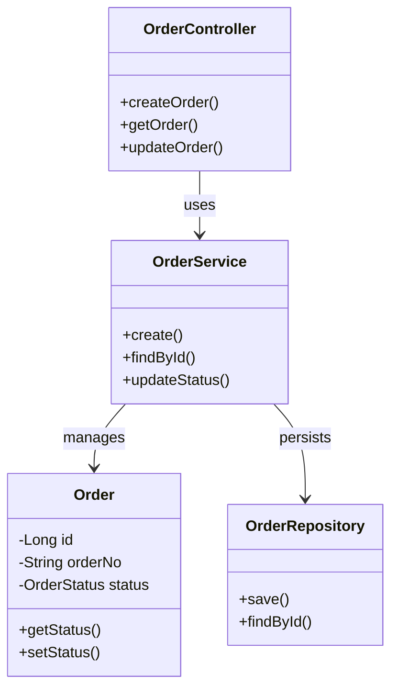
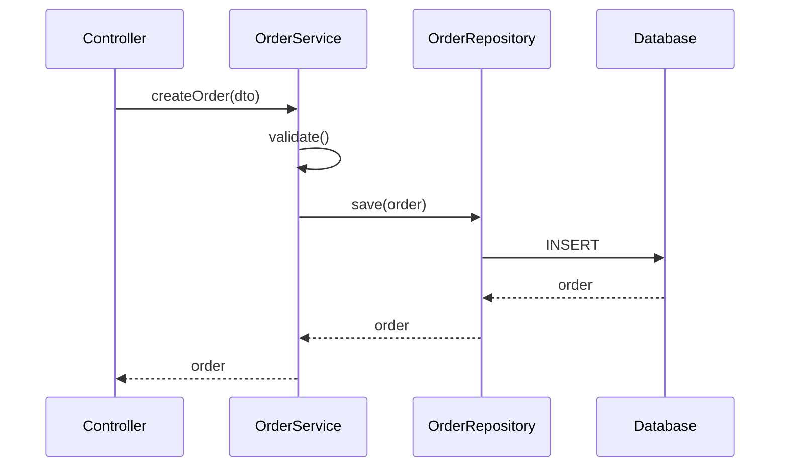
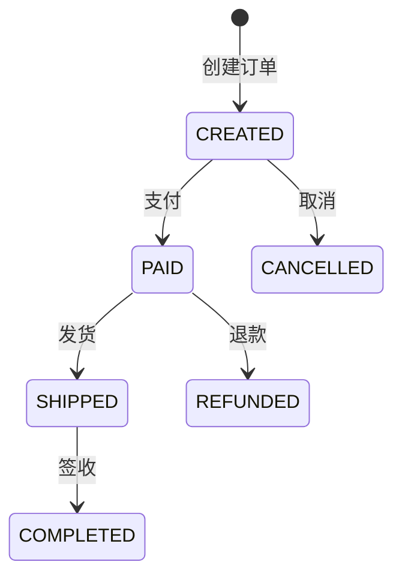
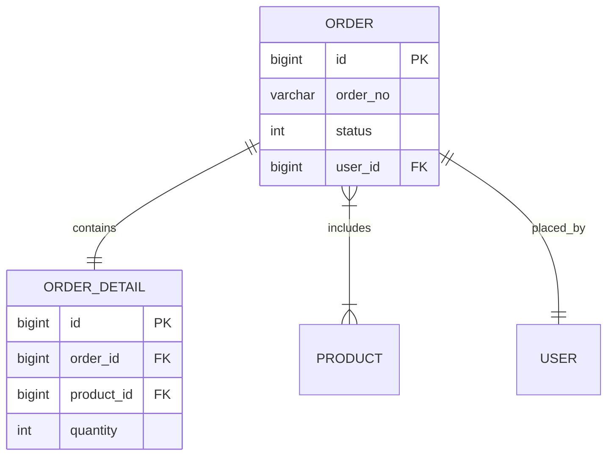

# biz-analysis-4j: Java 业务功能分析技能

## 概述

本技能用于深度分析 Java 项目的业务功能，从业务实体或数据库表出发，生成包含完整业务逻辑的 Markdown 分析报告。

**核心能力**：
- 实体定位：支持实体类名或数据库表名作为输入
- 入口识别：Controller 接口、MQ 监听器、定时任务
- 链路追踪：从 Controller 到 Repository 的完整调用链
- 实体建模：关联实体、值对象提取
- 状态分析：状态机和状态流转
- 图表生成：类图、时序图、状态图、ER图

**依赖技能**：`ast-grep-4j` - 用于底层 Java 代码分析

---

## 适用场景

### ✅ 适合场景
- 需要理解某个业务实体的完整生命周期
- 新成员快速了解业务逻辑
- 整理业务文档和架构图
- 代码审查前的业务逻辑梳理
- 系统重构前的业务分析

### ❌ 不适合场景
- 纯技术框架分析（无业务实体）
- 非 Java 项目
- 只需要简单的代码搜索

---

## 执行工作流

### Step 1: 解析用户输入

识别输入类型：
1. **实体类名**：如 `Order`、`UserEntity`（以大写字母开头，驼峰命名）
2. **数据库表名**：如 `t_order`、`user`（通常小写下划线命名）

### Step 2: 定位核心实体

#### 情况 A：输入为实体类名
直接使用该类作为分析起点。

#### 情况 B：输入为数据库表名
使用 ast-grep-4j 反向查找对应的实体类：

```bash
# 查找 MyBatis XML 中的 resultMap
ast-grep -p '<resultMap id="$ID" type="$CLASS" $$$>' -l xml <项目路径>/src/main/resources

# 查找 JPA @Table 注解
ast-grep -p '@Table(name = "$TABLE")' -l java <项目路径>
```

### Step 3: 识别业务入口点

#### 3.1 Controller 层入口

使用 ast-grep-4j 查找使用该实体的所有 Controller：

```bash
# 查找 @RestController 类中引用该实体的方法
ast-grep scan --inline-rules "id: controller-entries
language: java
rule:
  kind: method_declaration
  pattern: 'public $RET $NAME($ENTITY $PARAM, $$$)'
  inside:
    kind: class_declaration
    has:
      kind: annotation
      any:
        - pattern: '@RestController'
        - pattern: '@Controller'
      stopBy: end" <项目路径>
```

#### 3.2 MQ 消息队列入口

```bash
# 查找 @RabbitListener、@KafkaListener 等
ast-grep scan --inline-rules "id: mq-listeners
language: java
rule:
  kind: method_declaration
  has:
    kind: annotation
    any:
      - pattern: '@RabbitListener($$$)'
      - pattern: '@KafkaListener($$$)'
      - pattern: '@RocketMQMessageListener($$$)'
    stopBy: end
  pattern: 'public void $METHOD($ENTITY $PARAM, $$$)'" <项目路径>
```

#### 3.3 定时任务入口

```bash
# 查找 @Scheduled 方法中涉及该实体的操作
ast-grep scan --inline-rules "id: scheduled-tasks
language: java
rule:
  kind: method_declaration
  has:
    kind: annotation
    pattern: '@Scheduled($$$)'
    stopBy: end
  pattern: 'public void $METHOD($$$)'" <项目路径>
```

### Step 4: 追踪调用链路

对于每个入口方法，递归追踪调用链路到 Repository 层。

#### 4.1 找到入口方法定义

```bash
ast-grep -p '$RET $ENTRY_METHOD($$$)' -l java <项目路径>
```

#### 4.2 分析方法内部调用

```bash
# 查找方法内部调用的 Service/Manager 方法
ast-grep scan --inline-rules "id: method-calls
language: java
rule:
  kind: method_invocation
  pattern: '$SERVICE.$METHOD($$$)'
  inside:
    kind: method_declaration
    pattern: '$RET $ENTRY_METHOD($$$)'
    stopBy: end" <项目路径>
```

#### 4.3 递归追踪

对于每个调用的 Service 方法，重复 Step 4.2，直到：
- 到达 Repository 层（调用 `save`、`findById` 等方法）
- 到达外部接口调用（HTTP Client、RPC 调用）
- 到达最大递归深度（建议 7 层）

**边界识别**：
- Repository 方法：`save`、`findById`、`findAll`、`delete`、`update`
- 外部调用：`RestTemplate`、`FeignClient`、`HttpClient`、`@FeignClient`
- 第三方 JAR：包名不含项目 package 前缀

### Step 5: 提取实体关系

#### 5.1 实体类字段分析

```bash
# 查找实体类字段（包含关联关系注解）
ast-grep scan --inline-rules "id: entity-fields
language: java
rule:
  kind: field_declaration
  inside:
    kind: class_declaration
    pattern: 'class $ENTITY $$$'
    stopBy: end" <项目路径>
```

#### 5.2 识别关联关系

关注以下 JPA/MyBatis 注解：
- `@OneToOne`、`@OneToMany`、`@ManyToOne`、`@ManyToMany`
- `@Embedded`、`@Embeddable`（值对象）
- `@JoinColumn`、`@JoinTable`

### Step 6: 分析状态机

#### 6.1 识别状态字段

```bash
# 查找枚举类型字段或带 @Enumerated 的字段
ast-grep scan --inline-rules "id: status-fields
language: java
rule:
  kind: field_declaration
  any:
    - pattern: 'private $ENUM $STATUS;'
    - has:
        kind: annotation
        pattern: '@Enumerated($$$)'
        stopBy: end
  inside:
    kind: class_declaration
    pattern: 'class $ENTITY $$$'
    stopBy: end" <项目路径>
```

#### 6.2 分析状态流转

在调用链中查找状态变更：
```bash
# 查找状态赋值操作
ast-grep -p '$ENTITY.setStatus($NEW_STATUS)' -l java <项目路径>
```

### Step 7: 生成 Mermaid 图表

#### 7.1 类图（Class Diagram）

展示实体、Service、Controller、Repository 关系：



#### 7.2 时序图（Sequence Diagram）

展示核心业务流程：



#### 7.3 状态图（State Diagram）

展示状态流转：



#### 7.4 ER图（Entity Relationship Diagram）



### Step 8: 生成 Markdown 文档

使用以下模板结构输出：

```markdown
# {实体名称} 业务分析报告

## 一、业务概述
- 实体名称：{EntityName}
- 对应表名：{table_name}
- 业务描述：{根据代码分析得出的业务描述}

## 二、入口点分析
### 2.1 Controller 接口
| 类名 | 方法 | URL | 描述 |
|------|------|-----|------|
| OrderController | createOrder | POST /orders | 创建订单 |

### 2.2 MQ 监听器
...

### 2.3 定时任务
...

## 三、调用链路图
{mermaid 类图}

## 四、核心时序图
{mermaid 时序图}

## 五、实体关系图
{mermaid ER图}

## 六、状态机分析
{mermaid 状态图}
状态说明：
- CREATED: 已创建
- PAID: 已支付
...

## 七、方法清单
### Service 层
...
### Repository 层
...
```

---

## 输出要求

1. **文档格式**：标准 Markdown
2. **图表语法**：所有图表必须使用 Mermaid 语法
3. **表格规范**：使用 Markdown 表格展示入口点和方法清单
4. **代码块**：代码片段使用 ```java 标注语言
5. **层级清晰**：使用 ##、### 合理划分章节

---

## 边界与限制

1. **递归深度**：调用链分析最大 7 层，防止循环依赖
2. **边界识别**：追踪到 Repository 层或外部接口即停止
3. **命名约定**：依赖标准的 Java 命名和常用框架注解
4. **性能考虑**：大型项目建议先限定到具体模块目录

---

## 使用示例

**用户输入**：
> 分析一下 Order 实体

**执行流程**：
1. 识别为实体类名
2. 查找 OrderController、OrderService、OrderRepository
3. 追踪 createOrder -> OrderService.create -> OrderRepository.save 链路
4. 分析 OrderStatus 枚举和状态流转
5. 生成包含类图、时序图、状态图的 Markdown 报告

**用户输入**：
> 分析表 t_order

**执行流程**：
1. 识别为表名
2. 通过 MyBatis XML 找到 Order 实体类
3. 继续上述分析流程
