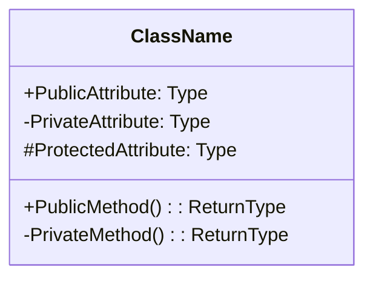
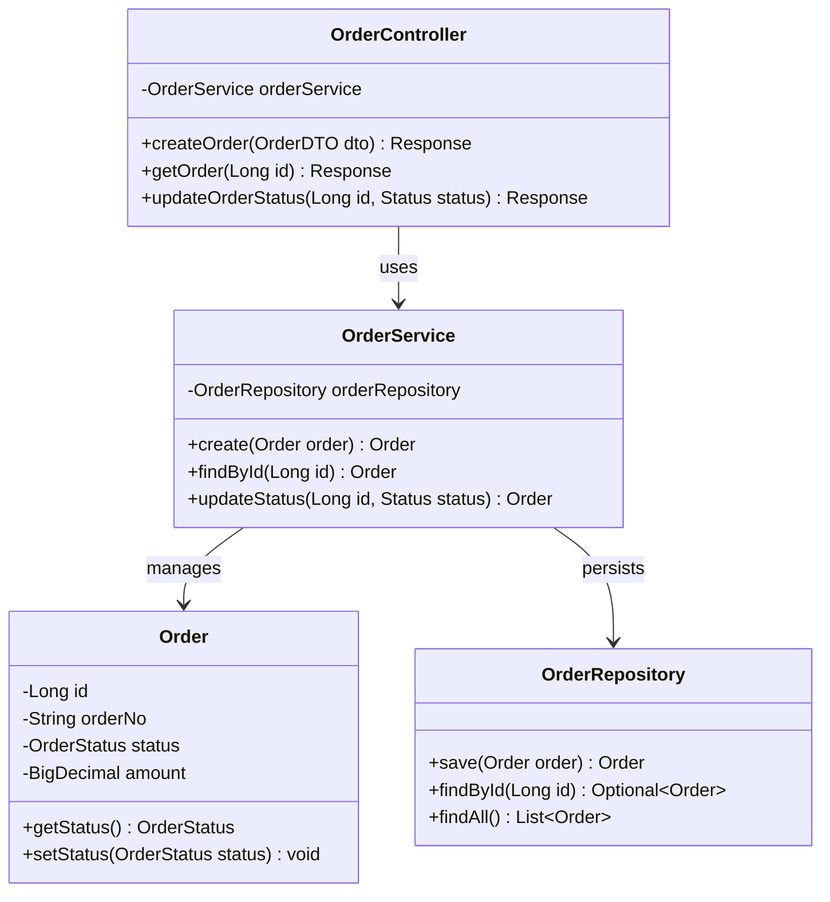
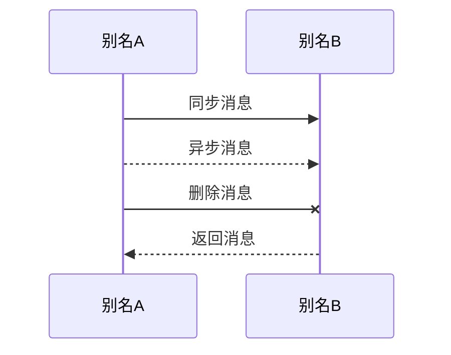
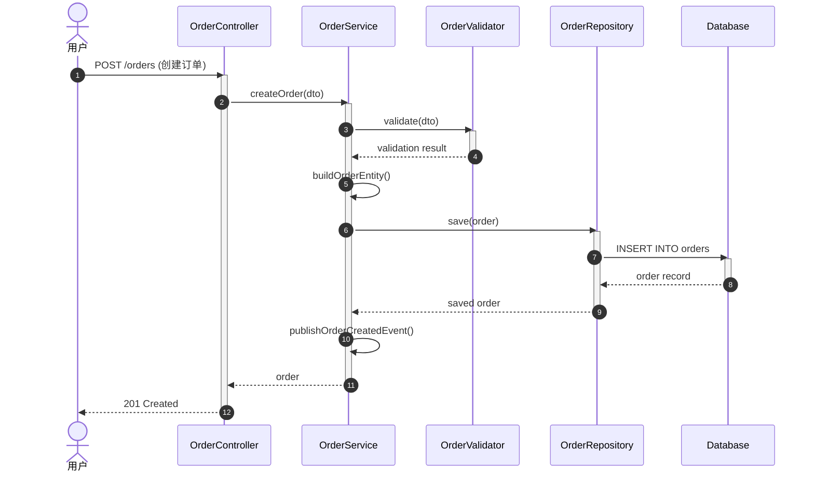
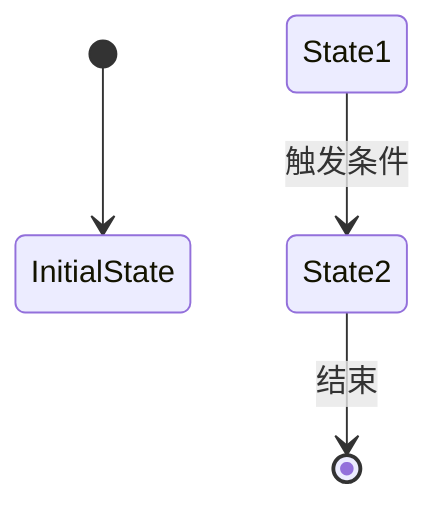
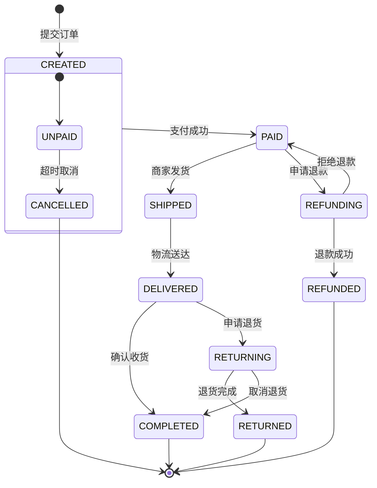
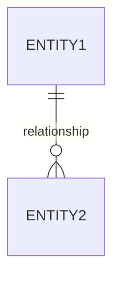
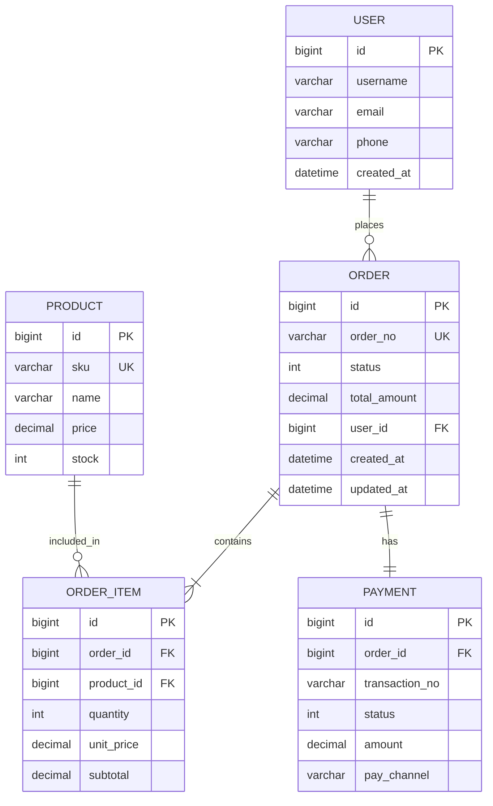
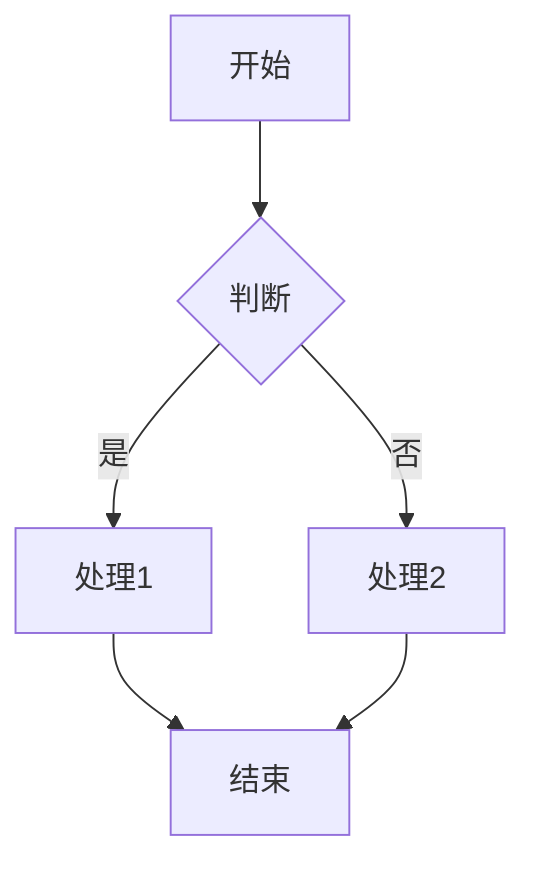

# Mermaid UML 语法参考

本文档提供 biz-analysis-4j 技能中使用的 Mermaid 图表语法参考。

---

## 1. 类图（Class Diagram）

### 基本语法

### 关系类型

| 语法 | 含义 | 示例 |
|------|------|------|
| `-->` | 关联（Association） | `A --> B` |
| `-->` | 依赖（Dependency） | `A ..> B` |
| `--|>` | 继承（Inheritance） | `B --|> A` |
| `..|>` | 实现（Realization） | `B ..|> A` |
| `o--` | 聚合（Aggregation） | `A o-- B` |
| `*--` | 组合（Composition） | `A *-- B` |

### 完整示例

---

## 2. 时序图（Sequence Diagram）

### 基本语法

### 常用符号

| 语法 | 含义 |
|------|------|
| `->>` | 实线箭头（同步调用） |
| `-->>` | 虚线箭头（返回消息） |
| `-x` | 实线叉（删除） |
| `--x` | 虚线叉（异步删除） |
| `activate`/`deactivate` | 激活/去激活生命线 |
| `Note over A,B` | 注释 |

### 完整示例

---

## 3. 状态图（State Diagram）

### 基本语法

### 状态类型

| 语法 | 含义 |
|------|------|
| `state "描述" as StateName` | 状态别名 |
| `state StateName { sub1 --> sub2 }` | 复合状态 |
| `<<choice>>` | 选择节点 |
| `<<fork>>` / `<<join>>` | 分叉/汇合 |

### 完整示例

---

## 4. ER图（Entity Relationship Diagram）

### 基本语法

### 关系基数

| 语法 | 含义 |
|------|------|
| `||` | 一对一（必须） |
| `o|` | 一对一（可选） |
| `}|` | 多对一 |
| `o{` | 零或多 |
| `}|{` | 一或多 |

### 完整示例

---

## 5. 流程图（Flowchart）

### 基本语法

### 节点形状

| 语法 | 形状 |
|------|------|
`A[文本]` | 矩形（过程） |
`A(文本)` | 圆角矩形（开始/结束） |
`A{文本}` | 菱形（判断） |
`A((文本))` | 圆形 |
`A[/文本/]` | 平行四边形（输入/输出） |

---

## 6. 最佳实践

### 图表方向
- 类图：`direction TB`（从上到下）或 `direction LR`（从左到右）
- 时序图：默认从左到右，参与者按调用顺序排列
- 状态图：使用 `stateDiagram-v2` 语法

### 命名规范
- 使用有意义的类名和方法名
- 中文别名使用 `as` 关键字：`participant C as Controller`
- 泛型使用 `~Type~` 语法：`List~Order~`

### 注释和说明
- 使用 `%% 注释` 添加图表注释
- 使用 `Note over A,B` 在时序图中添加说明
- 状态图中使用 `:` 标注状态流转条件

### 复杂图表拆分
当图表过于复杂时，建议：
1. 拆分为多个子图
2. 使用复合状态（state 嵌套）
3. 使用链接引用其他图表
