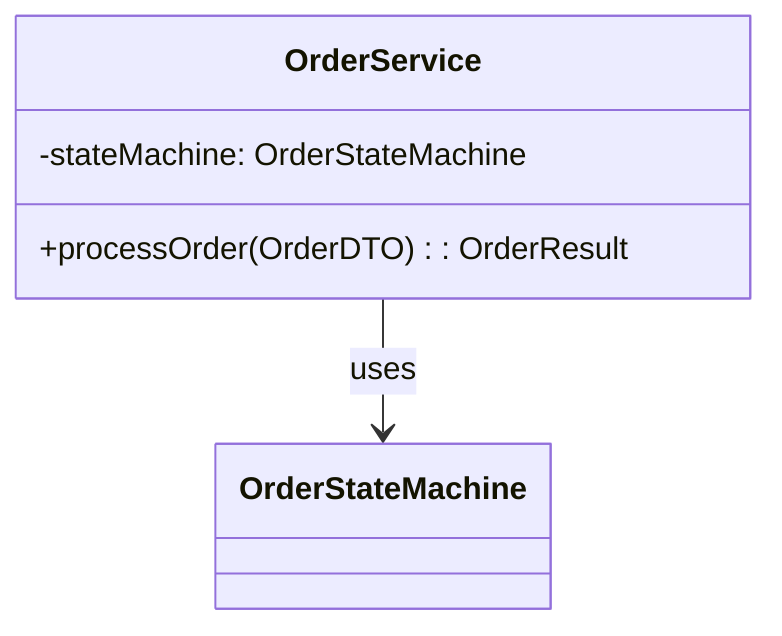
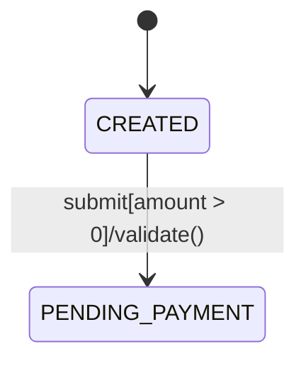
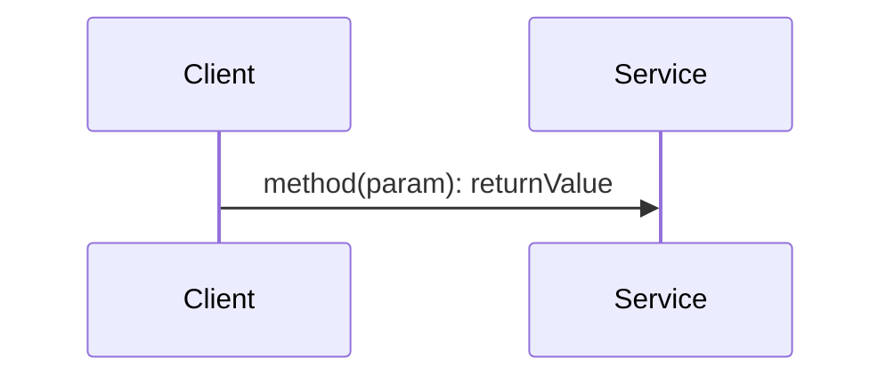

# Java 深度代码分析技能

## 简介

本技能帮助AI助手深度探索Java代码库中的特定功能，优先使用AST（抽象语法树）静态分析和LSP（语言服务协议）语义查询，当这些工具不可用时优雅降级到代码搜索，生成类图、状态机、时序图等Mermaid可视化图表，全面解构代码逻辑。

## 使用场景

- 理解复杂Java代码库的特定功能实现
- 需要代码结构的可视化图表
- 追踪方法调用链和数据流向
- 分析状态机、设计模式
- 评估异常边界和并发安全性

## 触发方式

使用以下关键词触发技能：
- "分析Java功能"
- "Java代码深度分析"
- "代码逻辑解构"

### 触发判定
当用户输入同时满足以下条件时触发：
1. 包含深度分析关键词："分析"、"深度"、"解构"、"状态机"、"调用链"
2. 包含Java代码元素：类名、方法名、功能模块名

**不会触发的情况**：
- "帮我找一下UserService的getUserById方法"（简单查询）
- "这个类是做什么的"（简单解释）

## 使用示例

### 示例1：分析订单状态机

```
分析订单状态机功能，入口是 OrderService.processOrder()
```

### 示例2：分析支付流程

```
请对支付模块进行深度分析，关注 PaymentService 的状态流转和异常处理
```

### 示例3：分析工作流引擎

```
分析 WorkflowEngine 的核心逻辑和扩展点设计
```

## 输出内容

技能将生成 `[功能名]_analysis.md` 文件，包含：

### 1. 分析置信度
每项分析都附带置信度评分，让用户了解结果的可靠程度：
| 维度 | 完整度 | 说明 |
|-----|-------|------|
| 类图 | 85% | 15%因反射调用无法静态分析 |
| 状态机 | 60% | 部分状态隐式推导，建议人工校验 |

### 2. 静态结构分析
- 类图 (classDiagram)
- 接口实现关系
- 依赖关系图
- 全限定类名(FQCN)标注

### 3. 动态逻辑分析
- 状态机图 (stateDiagram-v2)：显示状态转换、触发事件、守卫条件
- 时序图 (sequenceDiagram)：展示调用链路、同步/异步调用
- 控制流程图 (flowchart TD)：展示业务决策树

### 4. 边界与异常分析
- 未捕获异常路径及风险等级
- 边界参数识别（常量、枚举、阈值）
- 并发安全性评估（synchronized、volatile、竞态条件）

## 技术实现

### 核心能力

**逻辑穿透**：追踪从入口（API/Event/Timer）到执行终点（DB/IO/Network）的完整调用链路。

### 多层级分析策略

| 优先级 | 工具 | 用途 | 降级条件 |
|-------|------|------|---------|
| 1 | LSP | 精确引用查找、调用链追踪 | 无语言服务器或超时 |
| 2 | AST | 语法树解析、语义分析 | 无解析器或解析失败 |
| 3 | 代码搜索 | 正则匹配、文本搜索 | 始终可用（保底方案） |

### LSP工具使用
- `textDocument/definition`：跳转到定义
- `textDocument/references`：查找所有引用
- `callHierarchy/incomingCalls/outgoingCalls`：构建调用树

### AST解析器使用
- **JavaParser**：解析类声明、方法调用、表达式
- **Spoon**：元模型分析、代码转换

### 代码搜索策略（降级方案）
当LSP/AST不可用时，使用正则表达式搜索：
- 类定义：`class\s+类名`
- 继承关系：`extends\s+\w+|implements\s+[\w,\s]+`
- 方法调用：逐层BFS追踪，深度限制3-5层

### 降级后置信度调整

| 降级场景 | 置信度调整 | 说明 |
|---------|-----------|------|
| LSP→搜索 | -10%~-15% | 引用关系可能不完整 |
| AST→搜索 | -15%~-20% | 语法分析精度下降 |
| 完全降级 | -25%~-30% | 仅使用正则搜索 |

### 错误处理与场景应对
| 场景 | 处理策略 |
|-----|---------|
| 入口类不存在 | 搜索相似类名，向用户推荐 |
| 搜索结果过多 | 按包名过滤，按引用次数排序 |
| 循环依赖 | DFS+访问集合检测，标注并截断 |
| 第三方库 | 仅分析Entry Point，明确标注不深入 |
| 反射/动态代理 | 降低置信度，说明局限性 |

## 目录结构

```
java-deep-analysis/
├── SKILL.md              # 技能核心定义（AI使用）
├── README.md             # 本文件（人类阅读）
├── evals/
│   └── evals.json        # 评估测试配置（10个测试用例）
└── reference/            # 参考资料
```

## 分析深度要求

| 分析维度 | 最低要求 | 深度要求 |
|---------|---------|---------|
| 类关系 | 直接依赖 | 间接依赖3层 |
| 调用链 | 主流程 | 所有分支路径 |
| 状态机 | 显式状态 | 隐式状态推导 |
| 异常分析 | 已处理异常 | 潜在风险点 |

## 范围控制策略

当功能涉及类超过20个时：
1. **优先级排序**：
   - P0（必须分析）：入口类、核心业务类、状态机类
   - P1（建议分析）：服务层、数据访问层
   - P2（可选分析）：工具类、常量类、DTO

2. **包聚类**：按包分组展示，非核心包以"包名.*"聚合

## 注意事项

- 分析大型功能时，优先关注核心路径
- 遇到循环依赖时会标注并截断
- 第三方库只分析Entry Point，不深入内部实现
- 无法确定调用链路时会降低置信度并说明原因
- 置信度低于50%时会建议用户使用运行时调试

## Mermaid图表规范

### 类图


### 状态图

格式：`Source --> Target : Event[Guard]/Action`

### 时序图

- `->>` 同步调用
- `-->>` 异步调用
