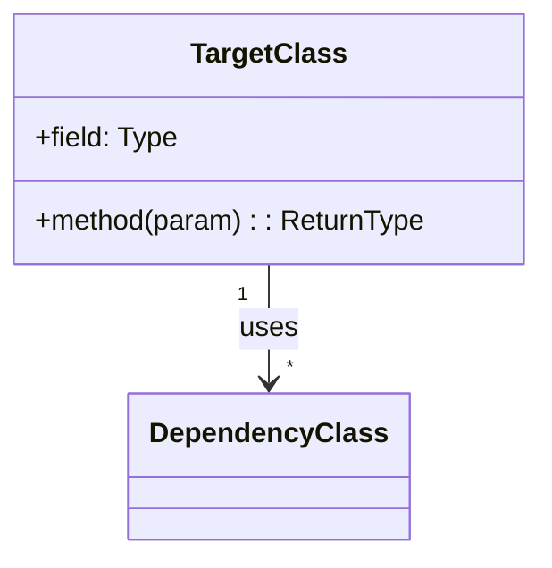
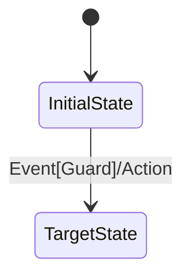
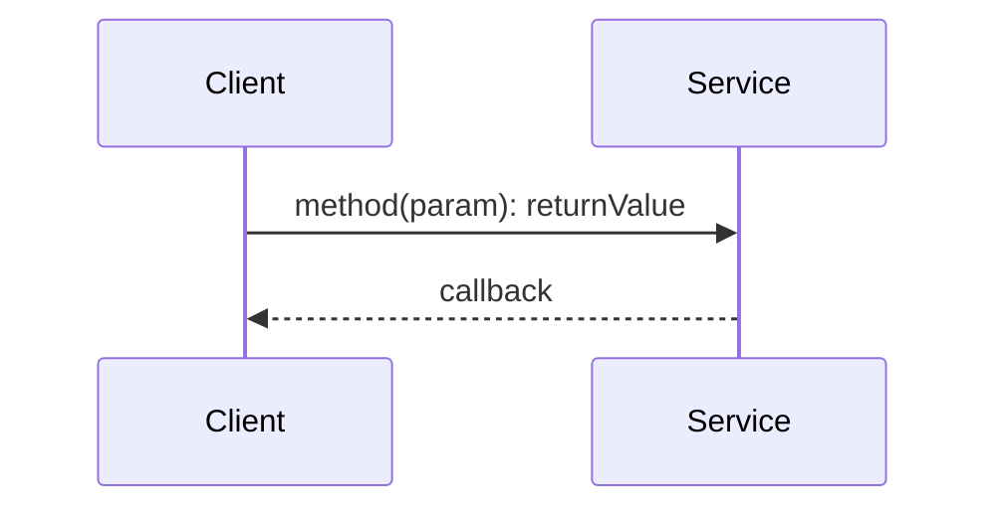
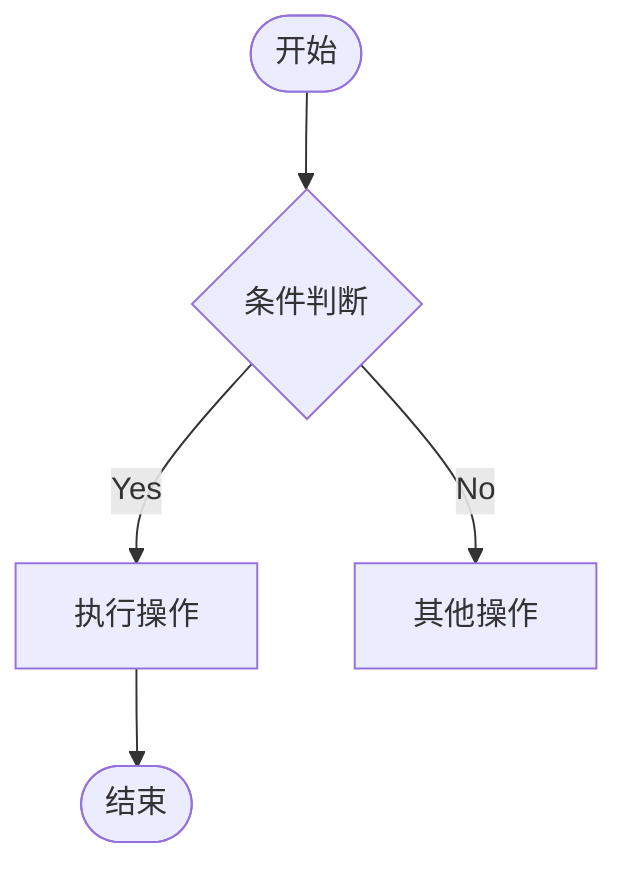
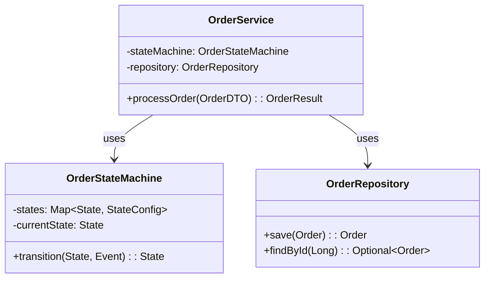
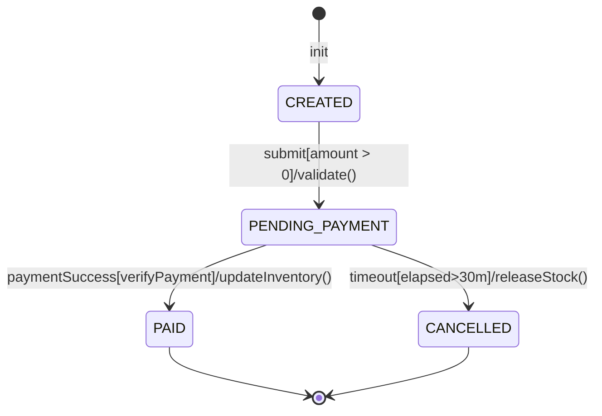
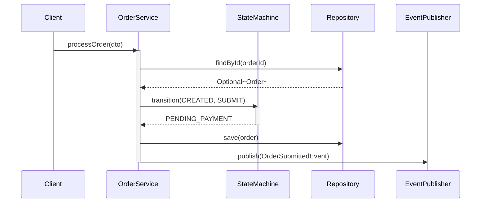
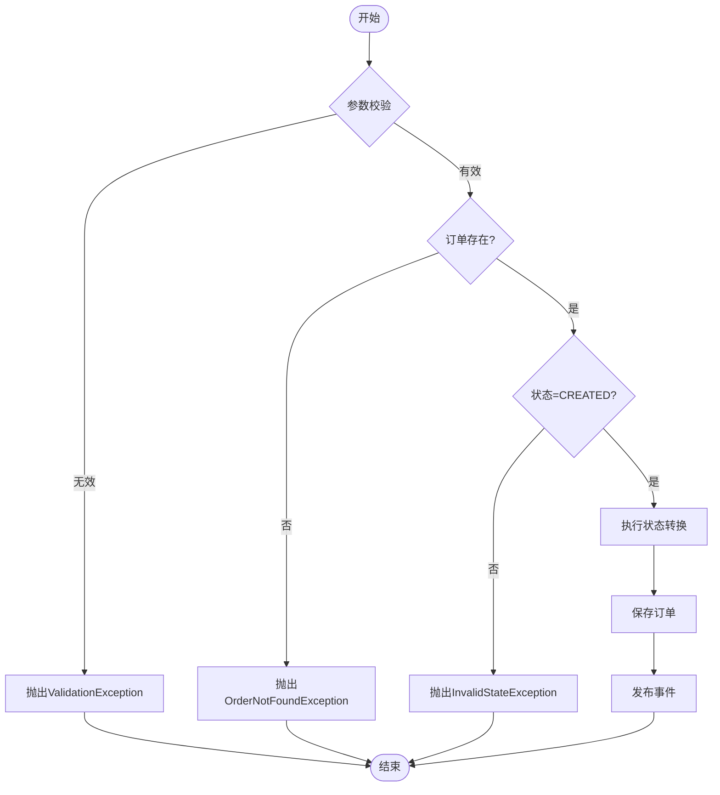

# Java 深度代码分析

## 一、适用场景判断

### 适合场景
- 需要理解复杂Java代码库的特定功能实现
- 需要生成代码结构的Mermaid可视化图表
- 需要追踪方法调用链和数据流向
- 需要分析状态机、设计模式、异常边界
- 需要结合AST、LSP和代码搜索进行静态分析

### 不适合场景
- 简单的代码阅读或查找单个方法（如"找到UserService.getUserById"）
- 非Java语言的代码分析
- 运行时性能分析或内存分析（需要Profiler工具）
- 代码自动生成或大规模重构

### 触发判定逻辑
当用户输入同时满足以下2项时触发：
1. 包含深度分析关键词："分析"、"深度"、"解构"、"状态机"、"调用链"
2. 包含Java代码元素：类名、方法名、功能模块名

当用户仅询问"某个方法在哪"、"这个类是做什么的"时，不触发此技能。

## 二、执行工作流

### Step 1: 接收分析目标
- 用户指定要分析的功能名称或入口类/方法
- 确认分析范围和深度要求（默认：核心路径+间接依赖2层）

### Step 2: 拓扑扫描（静态结构分析）

**首选方案**：使用LSP（Language Server Protocol）或AST工具
- LSP：调用`textDocument/definition`、`textDocument/references`获取精确引用
- AST：使用JavaParser、Spoon等库解析源码结构

**降级方案**：当LSP/AST工具不可用时，使用代码搜索工具

#### 2.1 识别核心类与接口

**使用LSP/AST时**：
- 调用LSP的`workspace/symbol`搜索类符号
- 使用AST解析类声明节点（ClassDeclaration）
- 提取继承关系（extends/implements节点）

**使用代码搜索时**：
```
1. 搜索入口类定义：pattern="class\s+入口类名"
2. 搜索相关接口：pattern="interface\s+\w+.*入口类名|入口类名.*implements"
3. 搜索继承关系：pattern="extends\s+\w+|implements\s+[\w,\s]+"
```

判定逻辑：
- 核心类：被3个以上其他类引用，或包含状态/业务逻辑
- 工具类：仅被1-2个类引用，且无状态（可忽略）
- 泛型提取：匹配pattern="<\w+(,\s*\w+)*>"，记录类型参数

#### 2.2 分析依赖关系
搜索策略：
```
1. 字段依赖：pattern="private\s+\w+\s+\w+;" - 组合关系
2. 方法参数：pattern="public\s+\w+\s+\w+\([^)]*\w+\s+\w+" - 依赖关系
3. 注入依赖：pattern="@(Autowired|Inject|Resource)"
```

#### 2.3 生成类图 (classDiagram)
语法规范：


Mermaid语法规则：
- 类名长度>30字符时使用别名：`class "VeryLongClassName" as VLC`
- 泛型简化表示：`Map~String,Order~`（最多保留2个参数）
- 方法签名过长时只显示参数类型简写
- 关系符号：继承(--|>)、实现(..|>)、关联(-->)、组合(\"*\"-->\"1\")

### Step 3: 逻辑穿透（动态逻辑分析）

**核心目标**：追踪从入口（API/Event/Timer）到执行终点（DB/IO/Network）的完整调用链路。

**首选方案**：使用LSP或AST工具
- LSP：`textDocument/definition`、`textDocument/references`追踪调用链
- AST：遍历方法调用表达式（MethodInvocation节点）

**降级方案**：当LSP/AST不可用时，使用代码搜索+BFS遍历

#### 3.1 有限状态机推导

**使用LSP/AST时**：
- AST：扫描赋值表达式（Assignment）中的状态字段
- 分析条件语句（IfStatement、SwitchStatement）中的状态判断
- 提取方法调用作为触发事件

**使用代码搜索时**：
```
1. 状态变量：pattern="(enum|final)\s+\w+\s+(STATE|Status|State)"
2. 状态赋值：pattern="this\.\w+State\s*=\s*\w+"
3. 状态判断：pattern="if\s*\(\s*\w+\s*==\s*\w+\s*\)"
```

推导逻辑：
- 从状态变量所有赋值点收集目标状态
- 分析赋值所在的条件分支（If-Else/Switch）
- 记录触发方法（调用栈上一层）和守卫条件（if条件表达式）

生成状态图语法：


标准格式：`Source --> Target : Event[Guard]/Action`
- Event: 触发状态转换的方法名或信号
- Guard: 方括号内的条件表达式（可选）
- Action: 斜杠后的副作用操作（可选）

#### 3.2 符号追踪时序

**使用LSP/AST时**：
- LSP：`textDocument/references`获取方法的所有调用点
- LSP：`callHierarchy/incomingCalls`/`outgoingCalls`构建调用树
- AST：遍历MethodInvocation节点构建调用图

**使用代码搜索时**：
```
1. 入口方法：pattern="public\s+\w+\s+入口方法名\s*\("
2. 内部调用：逐层搜索方法体内的调用表达式
3. 调用深度限制：核心路径最深5层，分支路径最深3层
```

链路追踪算法（搜索模式）：
```
BFS(入口方法, 最大深度):
    queue = [(入口方法, 0)]
    visited = set()
    while queue:
        method, depth = queue.pop()
        if depth > 最大深度: continue
        if method in visited: continue (处理循环依赖)
        visited.add(method)
        
        搜索method的方法体中的调用
        for call in 方法体调用:
            queue.push((call, depth+1))
```

生成时序图语法：


规范：
- 同步调用：`->>`，异步调用：`-->>`
- 参与者名称使用类名简写（如OrderService->OS）
- 标注关键参数和返回值类型

#### 3.3 决策控制流分析
搜索策略：
```
1. If-Else链：pattern="if\s*\(|else\s+if\s*\(|else\s*\{"
2. Switch语句：pattern="switch\s*\([^)]+\)"
3. 三元表达式：pattern="\?\s*[^:]+:\s*[^;]+"
```

生成流程图语法：


### Step 4: 边界与异常分析

**首选方案**：使用AST工具分析语法树节点
- AST：扫描ThrowsDeclaration、TryStatement、CatchClause节点
- AST：识别SynchronizedStatement、Volatile修饰符

**降级方案**：使用代码搜索工具

#### 4.1 未捕获异常路径

**使用LSP/AST时**：
- AST：遍历ThrowsDeclaration节点获取声明的异常
- AST：扫描TryStatement的CatchClause分析处理情况
- LSP：搜索@Transactional注解位置

**使用代码搜索时**：
```
1. throws声明：pattern="throws\s+\w+"
2. RuntimeException：pattern="throw\s+new\s+\w*Exception"
3. try-catch块：pattern="try\s*\{|catch\s*\([^)]+\)\s*\{"
4. 事务注解：pattern="@Transactional"
```

分析逻辑：
- 方法签名中声明的checked exception未在try-catch中处理→标注为传播风险
- throw new XXException()不在try块内→标注为未捕获风险点
- @Transactional方法抛出未声明的RuntimeException→标注事务回滚边界

#### 4.2 边界参数分析

**使用AST时**：
- 扫描VariableDeclaration中的final常量
- 提取EnumDeclaration的所有常量

**使用代码搜索时**：
```
1. 常量定义：pattern="(public\s+)?(static\s+)?final\s+\w+\s+\w+\s*=\s*[^;]+"
2. 枚举范围：pattern="enum\s+\w+\s*\{([^}]+)\}"
3. 硬编码阈值：pattern="if\s*\([^)]*\d+[^)]*\)" 或 pattern="return\s+\d+"
```

#### 4.3 并发安全性评估

**使用AST时**：
- 扫描SynchronizedStatement节点
- 识别FieldDeclaration中的volatile修饰符
- 分析方法是否访问共享字段

**使用代码搜索时**：
```
1. synchronized：pattern="synchronized\s*[\(\{]"
2. volatile：pattern="volatile\s+\w+"
3. 线程池：pattern="Executor|ThreadPool|ExecutorService"
4. 并发集合：pattern="ConcurrentHashMap|CopyOnWriteArrayList"
```

评估逻辑：
- 状态修改方法无synchronized/volatile→标注竞态条件风险
- 共享变量被多线程访问→检查是否使用并发集合

### Step 5: 生成分析报告

将分析结果输出到Markdown文件 `[功能名]_analysis.md`：

```markdown
# [功能名] 深度分析报告

## 分析置信度
| 维度 | 完整度 | 说明 |
|-----|-------|------|
| 类图 | 85% | 15%因反射调用无法静态分析 |
| 状态机 | 60% | 部分状态隐式推导，建议人工校验 |
| 时序图 | 90% | 核心链路完整 |
| 异常分析 | 75% | 动态代理异常路径可能遗漏 |

## 1. 静态结构：类图

## 2. 动态逻辑
### 2.1 状态机
### 2.2 时序图
### 2.3 控制流

## 3. 边界与异常
### 3.1 未捕获异常风险
### 3.2 并发安全评估
### 3.3 边界参数识别
```

## 三、输出要求

### 强制要求
1. **必须使用Mermaid图表**：所有逻辑分析必须配以相应的Mermaid图表，禁止仅用文字描述
2. **语义引用**：标注代码的FQCN（全限定类名），格式：`com.example.service.OrderService`
3. **工具协同**：如果某个调用链路不清晰，提示用户："调用链路在 [类名/方法名] 处中断，可能需要进一步分析 [依赖库名]"

### Mermaid图表规范

1. **类图 (classDiagram)**
   - 显示类名、关键字段、核心方法
   - 使用正确的关系符号：
     - 继承：`Child --|> Parent`
     - 实现：`Impl ..|> Interface`
     - 关联：`A --> B`
     - 组合：`Container \"1\" --\"*\" Item`
   - 分组相关类：使用`namespace`或注释分组
   - 类名过长使用别名

2. **状态图 (stateDiagram-v2)**
   - 标注初始状态`[*]`和终止状态`[*]`
   - 使用标准格式：`Source --> Target : Event[Guard]/Action`
   - 复合状态使用`state "名称" { ... }`

3. **时序图 (sequenceDiagram)**
   - 参与者按调用顺序从左到右排列
   - 同步调用`->>`，异步调用`-->>`，自调用`->>self`
   - 使用`activate`/`deactivate`标注对象生命周期
   - 关键参数和返回值在消息中标注

4. **流程图 (flowchart TD)**
   - 使用菱形`{条件}`表示决策点
   - 标注条件分支的Yes/No路径或具体条件
   - 使用不同颜色标注关键业务节点（如`style Important fill:#f9f`）

### 分析深度要求

| 分析维度 | 最低要求 | 深度要求 | 定义 |
|---------|---------|---------|------|
| 类关系 | 直接依赖 | 间接依赖3层 | 第1层：字段引用；第2层：方法参数/返回；第3层：方法体内创建 |
| 调用链 | 主流程 | 所有分支路径 | 主流程：Happy Path；分支：所有if-else/switch分支 |
| 状态机 | 显式状态 | 隐式状态推导 | 显式：枚举/常量定义；隐式：从赋值推导的状态 |
| 异常分析 | 已处理异常 | 潜在风险点 | 已处理：try-catch内；潜在：throws声明、未包裹的throw |

### 分析范围控制

当功能涉及类过多时的处理策略：

1. **类数量判定**：
   - 从入口类开始BFS遍历
   - 每层收集直接引用的类
   - 累计>20个类时触发范围控制

2. **优先级排序**：
   - P0（必须分析）：入口类、核心业务类、状态机类
   - P1（建议分析）：服务层、数据访问层
   - P2（可选分析）：工具类、常量类、DTO

3. **包聚类策略**：
   - 按包(package)分组展示类图
   - 非核心包的类以"包名.*"形式聚合

## 四、工具检测与降级策略

### 工具可用性检测

在分析开始前，检测以下工具是否可用：

```
检测顺序：
1. LSP服务：检查是否有Java语言服务器连接（如Eclipse JDT LS、IntelliJ IDEA）
2. AST解析器：检查是否可调用JavaParser、Spoon等库
3. 代码搜索工具：使用search_content、search_file等基础工具（始终可用）
```

### 工具降级策略

| 检测顺序 | 工具类型 | 降级条件 | 降级后方案 |
|---------|---------|---------|-----------|
| 1 | LSP | 无语言服务器连接或返回超时 | 使用代码搜索+BFS模拟引用查找 |
| 2 | AST | 无解析器或无法解析源码 | 使用正则表达式搜索语法模式 |
| 3 | 代码搜索 | 始终可用 | 基础方案，置信度相应降低 |

### 降级触发时机

1. **LSP降级**：当`textDocument/definition`返回空或超时时
2. **AST降级**：当AST解析抛出异常或无法找到类文件时
3. **混合策略**：优先使用可用工具，缺失部分用搜索补充

### 降级后置信度调整

| 降级场景 | 置信度调整 | 说明 |
|---------|-----------|------|
| LSP→搜索 | 类图：-10%，时序图：-15% | 引用关系可能不完整 |
| AST→搜索 | 状态机：-20%，异常分析：-15% | 语法分析精度下降 |
| 完全降级 | 整体：-25%~-30% | 仅使用正则搜索 |

## 五、错误处理与场景应对

### 场景1：入口类/方法不存在
处理流程：
1. 搜索相似类名：`pattern="class\s*\w*相似词\w*"`
2. 向用户推荐：`"未找到'OrderService'，是否指'OrderProcessService'或'OrderBizService'?"`
3. 如无相似类，询问用户确认类名

### 场景2：搜索工具返回结果过多
处理流程：
1. 按包名过滤（优先核心业务包：service, core, domain）
2. 按引用次数排序（使用grep统计import出现次数）
3. 提示用户："发现多个匹配类，请确认具体是：1) xxx 2) xxx"

### 场景3：循环依赖检测
处理算法：
```
detectCycle(current, path):
    if current in path:
        cycle = path[path.index(current):] + [current]
        return cycle
    for dep in current.dependencies:
        result = detectCycle(dep, path + [current])
        if result: return result
    return null
```
处理策略：检测到循环时，在图中用虚线标注循环点，并截断不再深入。

### 场景4：第三方库调用
边界定义：
- 标准JDK（java.util, java.lang）：深入1层
- Spring框架（org.springframework）：分析到Bean初始化
- 其他第三方库：仅分析Entry Point，不深入内部

处理方式：在时序图中标注为`第三方:LibraryClass`，并说明"第三方库内部逻辑未展开"

### 场景5：分析结果为空或不完整
置信度<50%时：
1. 明确告知用户分析局限性
2. 列出无法分析的原因（如反射调用、动态代理）
3. 提供建议："建议使用运行时调试获取完整调用链"

## 六、示例

### 示例输入
> "分析订单状态机功能，入口是OrderService.processOrder()"

### 示例输出结构

```markdown
# 订单状态机深度分析

## 分析置信度
| 维度 | 完整度 | 说明 |
|-----|-------|------|
| 类图 | 90% | 反射创建的部分依赖未识别 |
| 状态机 | 85% | 所有显式状态已覆盖 |
| 时序图 | 95% | 核心链路完整 |
| 异常分析 | 70% | AOP异常处理无法静态分析 |

## 1. 静态结构

### 核心类拓扑
- `com.example.order.OrderService` - 服务入口
- `com.example.order.OrderStateMachine` - 状态机核心
- `com.example.order.OrderRepository` - 数据访问
- `com.example.order.event.OrderEventPublisher` - 事件发布

### 类图


## 2. 动态逻辑

### 2.1 状态机推导
状态变量：`OrderStateMachine.currentState` (类型: `OrderState` 枚举)

状态转换识别：
- `processOrder()` 中: CREATED → PENDING_PAYMENT
- `onPaymentSuccess()` 中: PENDING_PAYMENT → PAID
- `onTimeout()` 中: PENDING_PAYMENT → CANCELLED



### 2.2 时序图


### 2.3 控制流


## 3. 边界与异常

### 3.1 未捕获异常风险
| 位置 | 异常类型 | 风险等级 | 说明 |
|-----|---------|---------|------|
| OrderService:42 | OrderNotFoundException | 🔴 高 | 未try-catch，直接抛出 |
| StateMachine:58 | IllegalStateException | 🟡 中 | 未在方法签名声明 |

### 3.2 并发安全评估
- `StateMachine.transition()` 方法缺少synchronized修饰
- `currentState` 字段非volatile
- **风险**：多线程环境下可能出现状态不一致

### 3.3 边界参数识别
```java
// OrderService.java:25
private static final int TIMEOUT_MINUTES = 30;  // 超时阈值

// OrderState 枚举
enum OrderState { CREATED, PENDING_PAYMENT, PAID, CANCELLED, REFUNDED }
```

### 3.3 事务边界
- `OrderService.processOrder()` 标注 `@Transactional`
- 抛出 `RuntimeException` 时将触发回滚
```
```

## 七、注意事项

1. **分析范围控制**：如果功能涉及类过多(>20个)，优先分析核心路径，在报告中提示用户扩展分析范围
2. **循环依赖处理**：遇到循环依赖时，截断并标注循环引用点，不无限递归
3. **第三方库**：对第三方库只分析Entry Point，不深入内部实现，在图表中明确标注
4. **不确定时询问**：当调用链路不清晰或无法确定类关系时，主动告知用户分析局限性，并提供可能选项
5. **置信度透明**：始终在报告开头提供分析置信度，让用户了解结果的可靠程度
