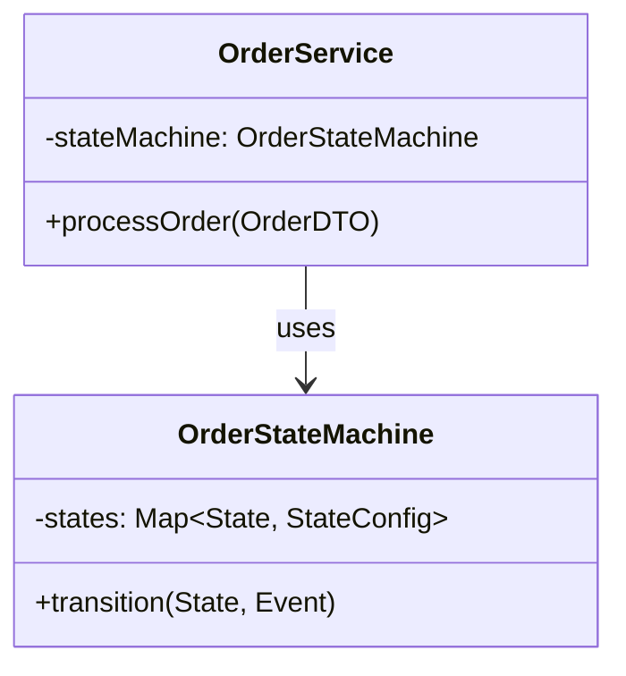
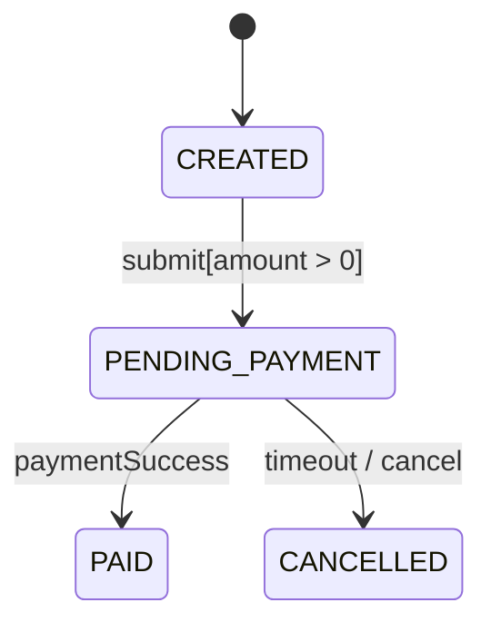
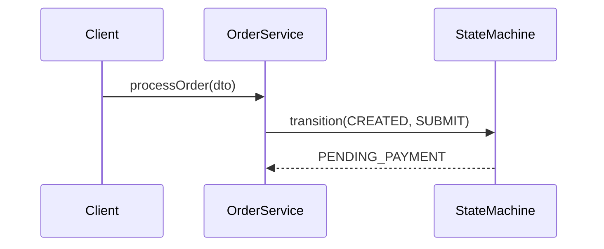

# Java 深度代码分析

## 一、适用场景判断

### ✅ 适合场景
- 需要理解复杂Java代码库的特定功能实现
- 需要生成代码结构的Mermaid可视化图表
- 需要追踪方法调用链和数据流向
- 需要分析状态机、设计模式、异常边界
- 需要结合LSP和AST进行静态代码分析

### ❌ 不适合场景
- 简单的代码阅读或查找单个方法
- 非Java语言的代码分析
- 运行时性能分析或内存分析
- 代码重构或自动生成代码

## 二、执行工作流

### Step 1: 接收分析目标
- 用户指定要分析的功能名称或入口类/方法
- 确认分析范围和深度要求

### Step 2: 拓扑扫描（静态结构分析）

使用LSP和AST工具执行以下扫描：

1. **识别核心类与接口**
   - 扫描与目标功能相关的所有类、接口、抽象类
   - 识别泛型类型和类型参数
   - 记录继承关系和实现关系

2. **分析依赖关系**
   - 通过LSP的符号引用(Symbol Reference)区分组合关系与临时调用
   - 识别第三方库的Entry Point
   - 标记@Autowired/@Inject等注入依赖

3. **生成类图 (classDiagram)**
   ```mermaid
   classDiagram
       class TargetClass {
           +field: Type
           +method()
       }
       TargetClass ..> DependencyClass : uses
   ```

### Step 3: 逻辑穿透（动态逻辑分析）

1. **有限状态机推导**
   - 扫描状态变量的所有赋值点
   - 分析条件分支(If-Else/Switch)中的状态转换
   - 识别触发方法和守卫条件
   - 生成状态图 (stateDiagram-v2)

2. **符号追踪时序**
   - 利用LSP的Definition/Implementation追踪跨类方法调用
   - 从入口到执行终点(DB/IO/Network)的完整链路
   - 生成时序图 (sequenceDiagram)

3. **决策控制流分析**
   - 基于AST逻辑分支还原业务决策树
   - 识别关键条件节点
   - 生成流程图 (flowchart TD)

### Step 4: 边界与异常分析

1. **未捕获异常路径**
   - 扫描方法签名中的`throws`声明
   - 识别未被try-catch包裹的RuntimeException风险点
   - 标注@Transactional等事务边界

2. **边界参数分析**
   - 识别AST中的常量定义、枚举范围
   - 记录硬编码阈值和配置项

3. **并发安全性评估**
   - 识别`synchronized`块、`volatile`关键字
   - 分析线程池调用和并发集合使用
   - 评估竞态条件风险

### Step 5: 生成分析报告

将分析结果输出到Markdown文件 `[功能名]_analysis.md`：

```markdown
# [功能名] 深度分析报告

## 1. 静态结构：类图

## 2. 动态逻辑

### 2.1 状态机

### 2.2 时序图

### 2.3 控制流

## 3. 边界与异常
```

## 三、输出要求

### 强制要求
1. **必须使用Mermaid图表**：所有逻辑分析必须配以相应的Mermaid图表，禁止仅用文字描述
2. **语义引用**：标注代码的FQCN（全限定类名）及AST节点类型（如：MethodDeclaration, LambdaExpression）
3. **工具协同**：如果某个调用链路不清晰，提示用户：“请Agent进一步跳转至 [类名/方法名] 的定义处”

### Mermaid图表规范

1. **类图 (classDiagram)**
   - 显示类名、字段、方法
   - 使用正确的关系符号（继承、实现、依赖、关联）
   - 分组相关类

2. **状态图 (stateDiagram-v2)**
   - 标注初始状态和终止状态
   - 显示状态转换的触发事件和守卫条件
   - 格式：`SourceState --> TargetState : Trigger[Guard]`

3. **时序图 (sequenceDiagram)**
   - 参与者按调用顺序排列
   - 显示同步调用(->>)和异步调用(-->>)
   - 标注关键参数和返回值

4. **流程图 (flowchart TD)**
   - 使用菱形表示决策点
   - 标注条件分支的Yes/No路径
   - 突出显示关键业务节点

### 分析深度要求

| 分析维度 | 最低要求 | 深度要求 |
|---------|---------|---------|
| 类关系 | 直接依赖 | 间接依赖（3层以内） |
| 调用链 | 主流程 | 所有分支路径 |
| 状态机 | 显式状态 | 隐式状态推导 |
| 异常分析 | 已处理异常 | 潜在风险点 |

## 四、示例

### 示例输入
> "分析订单状态机功能，入口是OrderService.processOrder()"

### 示例输出结构

```markdown
# 订单状态机深度分析

## 1. 静态结构

### 核心类拓扑
- `com.example.order.OrderService` - 服务入口
- `com.example.order.OrderStateMachine` - 状态机核心
- `com.example.order.OrderRepository` - 数据访问

### 类图


## 2. 动态逻辑

### 2.1 状态机推导


### 2.2 时序图


## 3. 边界与异常
- **未处理异常**: `OrderNotFoundException` (OrderService:42) 未被try-catch包裹
- **并发风险**: `StateMachine.transition()` 缺少同步控制
```

## 五、注意事项

1. **分析范围控制**：如果功能涉及类过多(>20个)，优先分析核心路径，提示用户扩展分析范围
2. **循环依赖处理**：遇到循环依赖时，截断并标注循环引用点
3. **第三方库**：对第三方库只分析Entry Point，不深入内部实现
4. **不确定时询问**：当调用链路不清晰或AST节点类型不明确时，主动询问用户是否需要进一步跳转
